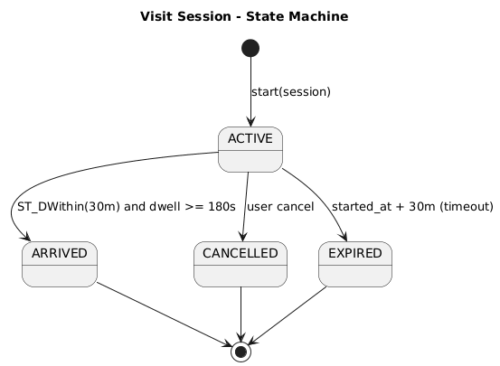
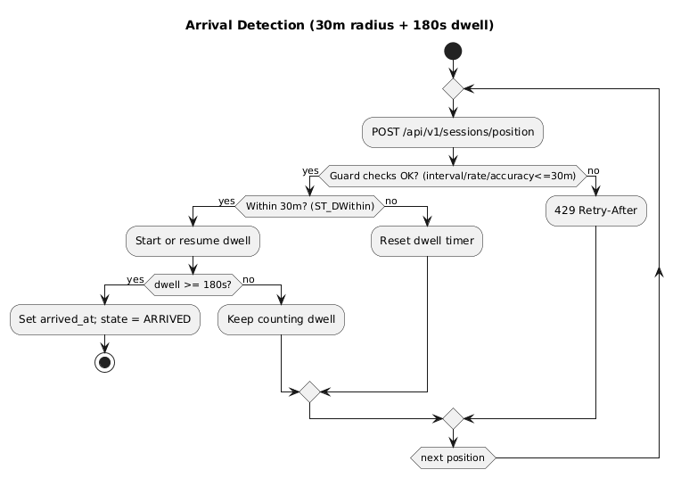
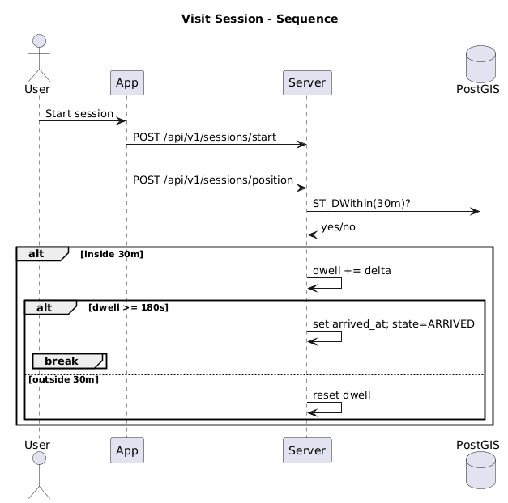
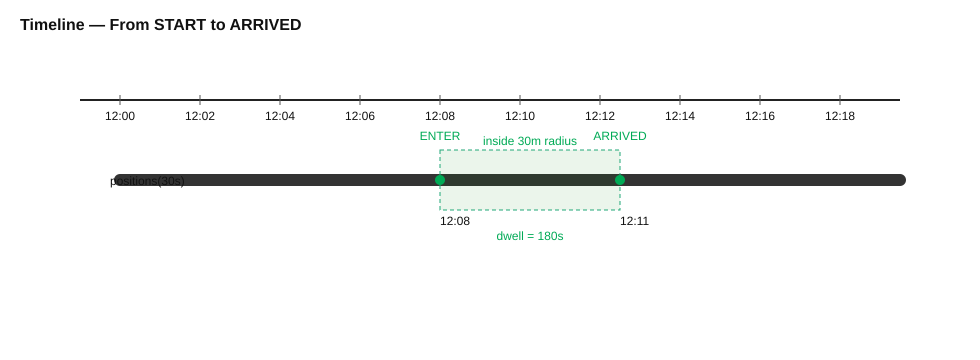

# 방문 세션(Visit Session) 개념 가이드
*작성일: 2025-09-19 | 기준: 반경 **30m** + 연속 **180s** 체류, 위치 간격 가드 navigation≥25s / idle≥5s*

## 1) 세션이란?
- 사용자가 특정 장소로 **출발→도착/만료/취소**로 끝나는 **한 번의 방문 여정**을 정의하는 **도메인 레코드**입니다.
- 목적: 실제 방문을 **객관적으로 증명**해 리뷰/좋아요 권한을 공정하게 부여하고, 도착율/ETA 등 **핵심 지표**의 단위가 됩니다.

## 2) 상태 머신
아래 다이어그램처럼 `ACTIVE → ARRIVED / CANCELLED / EXPIRED`로 전이합니다.

1) 방문 세션 상태 머신

    

2) 도착 판정 플로우(대안: 플로우차트 뷰)

    

    

- **ACTIVE**: 출발 직후, 위치 이벤트 수신 및 dwell 측정 중
- **ARRIVED**: 반경 30m 안에 **연속 180s** 체류
- **CANCELLED**: 사용자가 목적지 변경/포기
- **EXPIRED**: `started_at + 30분` 경과

## 3) 타임라인 예시
12:00 출발 → 12:08 반경 30m 진입 → 12:11 연속 180s 달성 → ARRIVED

## 4) 서버/클라 역할 분담
- **클라이언트**: 출발(start), **위치 이벤트 전송(30s)**, 필요 시 **수동 도착**(거리≤30m & 경과 10~60분 & 30s 쿨다운)
- **서버**: 위치 이벤트마다 `ST_DWithin(30m)` & **연속시간(180s)** 판정, **정확도/간격 가드**, 상태 전이·권한 부여

## 5) API 요약
- `POST /api/v1/sessions/start` — 세션 시작(ACTIVE)
- `POST /api/v1/sessions/position` — 위치 이벤트(서버가 지오펜스/도착 판정)
- `POST /api/v1/sessions/arrive` — 수동 확정(옵션)
- `POST /api/v1/sessions/cancel` — 사용자 취소
- `GET /api/v1/sessions/{id}/status` — 상태 조회
- `GET /api/v1/sessions/current` — 앱 재실행 시 복구

## 6) 설계 포인트(품질)
- **오탐 억제**: accuracy_m>30이면 dwell 중단(기록은 지속)
- **자원 보호**: 간격 가드 위반은 429(Retry-After)
- **개인정보 최소화**: 위치 이벤트 저장은 최소/보관기간 제한
